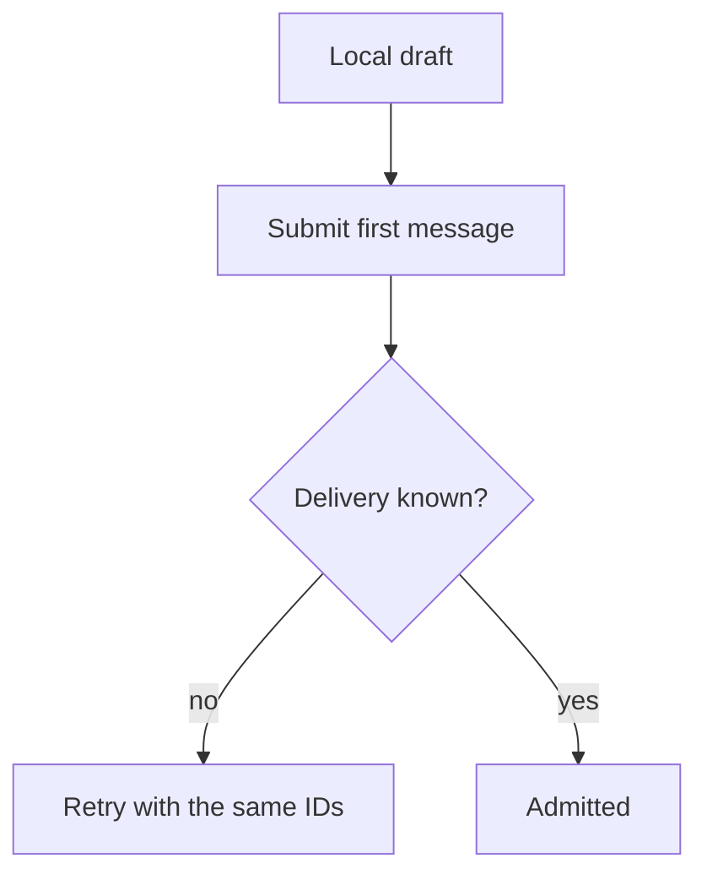

# Send a message

```mermaid
flowchart TD
    Draft[Local draft] --> Submit[Submit first message]
    Submit --> Unknown{Delivery known?}
    Unknown -->|no| Retry[Retry with the same IDs]
    Unknown -->|yes| Done[Admitted]
```

Open the [first send lifecycle](first-send.md) or the
[retry sequence](retry.md#ordering).
