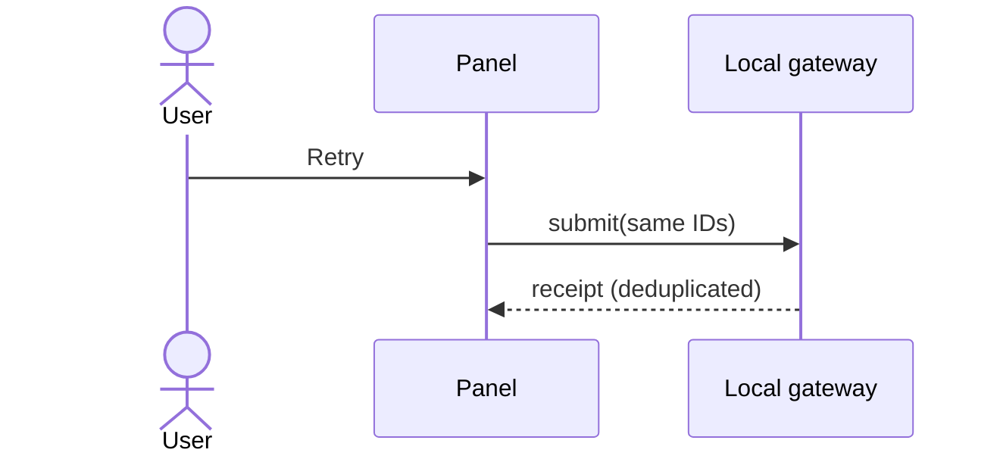

# Retry an uncertain send

## Ordering

```mermaid
sequenceDiagram
    actor User
    participant Panel
    participant Gateway as Local gateway
    User->>Panel: Retry
    Panel->>Gateway: submit(same IDs)
    Gateway-->>Panel: receipt (deduplicated)
```

Back to [the feature](README.md).
